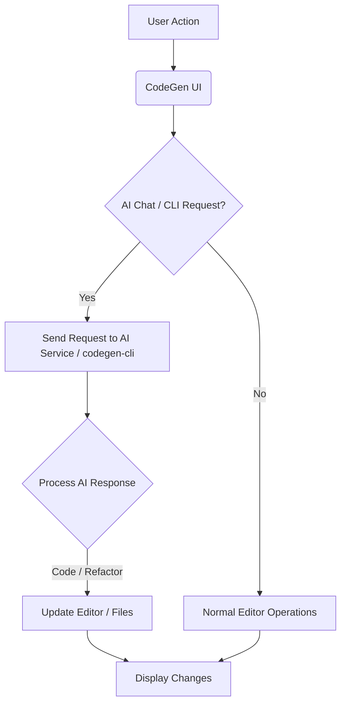
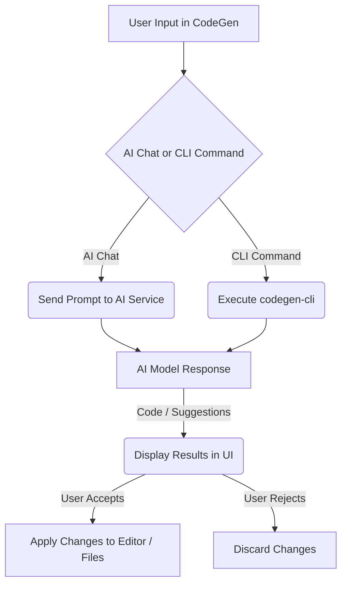

# CodeGen IDE

This repository contains the front-end application for **CodeGen**, a powerful, feature-rich code editor designed to empower developers with an integrated, AI-enhanced environment. Built with React, TypeScript, and Tailwind CSS, CodeGen provides a seamless experience for writing, managing, and collaborating on code, augmented by intelligent AI capabilities.


## Why CodeGen?

In today's fast-paced development landscape, efficiency and intelligent assistance are paramount. CodeGen addresses this by offering:

*   **AI-Driven Development:** Integrate directly with powerful AI models for code generation, explanation, debugging, and advanced refactoring.
*   **Seamless Workflow:** A unified environment combining a robust code editor, file explorer, integrated terminal, and AI chat, reducing context switching.
*   **Modern & Performant:** Leveraging cutting-edge frontend technologies (React, TypeScript, Vite, Tailwind CSS) for a snappy and responsive user experience.
*   **Extensible & Collaborative:** Designed with extensibility in mind and built to support real-time updates, paving the way for collaborative development features.

CodeGen aims to be your go-to environment for rapid prototyping, complex development, and intelligent code assistance.

## Table of Contents

- [Why CodeGen?](#why-codegen)
- [Installation](#installation)
- [Quick Start](#quick-start)
- [Development Setup](#development-setup)
- [Usage](#usage)
- [Core Features](#core-features)
- [CodeGen CLI Integration](#codegen-cli-integration)
- [Project Structure](#project-structure)
- [Documentation](#documentation)
- [Mermaid Diagrams in README](#mermaid-diagrams-in-readme)
- [Contributing](#contributing)
- [License](#license)
- [Author](#author)

## Installation

To get started with the CodeGen application, clone the repository and install the dependencies:

```bash
git clone https://github.com/evillan0315/code-editor
cd code-editor
npm install
# or yarn install
```

## Quick Start

Once installed, follow these steps to quickly get the application up and running and perform your first actions:

1.  **Start the Development Server:**
    ```bash
    npm run dev
    ```
    This will open the application in your browser, typically at `http://localhost:5173`.

2.  **Create Your First File:**
    *   In the file explorer (left sidebar), click the "New File" icon.
    *   Enter a filename (e.g., `index.js`) and press Enter.
    *   Start typing code in the editor!

3.  **Open the Integrated Terminal:**
    *   Click on the "Terminal" tab at the bottom of the screen.
    *   Type a command like `ls` or `pwd` to see it in action.

4.  **Ask the AI for Help:**
    *   Click on the "AI Chat" tab.
    *   Try a prompt like: "Generate a simple React functional component for a button."
    *   Copy the generated code and paste it into your editor.

## Development Setup

For new contributors or those looking to dive deeper into the project's development:

### Prerequisites

*   Node.js (LTS version recommended)
*   npm or Yarn package manager
*   Git

### Running the Application

To run the application in development mode:

```bash
npm run dev
# or yarn dev
```
This will start the Vite development server, enabling hot-module reloading and other development features.

### Building for Production

To build the application for production:

```bash
npm run build
# or yarn build
```
This command compiles and bundles the application, optimizing it for deployment.

### Running Tests (if applicable)

If tests are available, you can run them using:

```bash
npm test
# or yarn test
```

### Environment Variables

CodeGen may utilize environment variables for configuration (e.g., API keys, authentication settings). Refer to `.env.example` (if present) for required variables. You will need to create a `.env` file in the root directory and populate it with your specific values.

## Usage

After starting the application, you can interact with its various components:

*   **File Explorer:** Manage your project files and directories.
*   **Code Editor:** Write and edit code with advanced features.
*   **Tabs:** Easily switch between multiple open files.
*   **AI Chat:** Get instant AI assistance.
*   **Terminal:** Execute shell commands.

## Core Features

CodeGen is packed with features designed for a productive development experience:

*   **Integrated Code Editor (CodeMirror 6)**:
    *   A highly performant and extensible code editor powered by CodeMirror 6.
    *   Supports syntax highlighting for a multitude of programming languages.
    *   Provides advanced features like line numbering, code folding, and bracket matching.
    *   Customizable themes (Light and Dark mode) for personalized comfort.
*   **Intuitive File Explorer**:
    *   Browse, open, create, rename, and delete files and folders with ease.
    *   Visual representation of your project directory structure.
    *   Facilitates quick navigation and project management.
*   **Tabbed Interface for Open Files**:
    *   Effortlessly manage multiple open files simultaneously.
    *   Switch between different code contexts without losing your place.
    *   Visual indicators for unsaved changes.
*   **Intelligent AI Chat Integration**:
    *   Interact directly with AI models (e.g., Gemini Stream integration) for a wide range of tasks.
    *   Generate code snippets and boilerplate.
    *   Get explanations for complex code sections.
    *   Receive debugging suggestions and refactoring advice.
    *   **_Note:_** This feature integrates seamlessly with the `codegen-cli` for advanced AI operations (see below).
*   **Integrated Terminal**:
    *   Run shell commands directly within the editor environment.
    *   Execute scripts, compile code, or interact with version control without leaving CodeGen.
    *   Full terminal functionality, enhancing your development workflow.
*   **Robust Authentication System**:
    *   Secure user authentication (e.g., via GitHub, Google, or other providers).
    *   Ensures secure access to your projects and personalized settings.
*   **Customizable Theming**:
    *   Toggle between aesthetically pleasing light and dark modes.
    *   Provides a comfortable viewing experience in various lighting conditions.
*   **Realtime Updates (via WebSockets)**:
    *   Underlying WebSocket integration allows for real-time file system event handling.
    *   Lays the groundwork for future collaborative editing and live updates.

## CodeGen CLI Integration

CodeGen is designed to work hand-in-hand with the **`codegen-cli`** – a powerful command-line interface for AI-driven code generation, optimization, and refactoring.

*   **Repository:** [https://github.com/evillan0315/codegen-cli](https://github.com/evillan0315/codegen-cli)
*   **Purpose:** The `codegen-cli` extends CodeGen's capabilities by allowing you to:
    *   Generate new code files or components based on prompts.
    *   Apply intelligent refactorings to existing code.
    *   Optimize code for performance or readability, guided by AI.
*   **How it Integrates:** While `codegen-cli` is a separate tool, its functionalities are exposed and can be leveraged through CodeGen's integrated AI Chat and potentially future dedicated UI actions or terminal commands. Refer to the `codegen-cli` repository for its installation and usage instructions.

## Project Structure

The project follows a modular and well-organized structure to promote maintainability and scalability:

```
code-editor/
├── public/               # Static assets (images, favicon, etc.)
├── src/
│   ├── components/       # Reusable UI components
│   │   ├── editor/     # Core editor UI components (e.g., CodeMirror wrapper)
│   │   └── common/     # Generic, widely used components
│   ├── constants/        # Application-wide immutable values
│   ├── contexts/         # React Contexts for global state (less frequent, consider Nanostores)
│   ├── docs/             # Markdown documentation files (feature-specific, detailed guides)
│   │   ├── editor/     # In-depth documentation for editor functionalities
│   │   ├── ai-integration/ # Details on AI services and `codegen-cli` interaction
│   │   └── architecture.md # Overall system architecture
│   ├── hooks/            # Custom React Hooks for reusable logic
│   ├── providers/        # React Context Providers (for setting up global contexts)
│   ├── routes/           # Application routes and navigation configuration
│   ├── services/         # API services, external integrations, and utility functions
│   ├── stores/           # Nanostores for global, reactive state management
│   ├── styles/           # Tailwind CSS configuration and global CSS
│   ├── themes/           # CodeMirror specific themes
│   ├── types/            # TypeScript type definitions and interfaces
│   └── utils/            # General utility functions (e.g., date formatting, helper functions)
├── .env.example          # Example environment variables
├── package.json          # Project metadata and dependencies
└── tsconfig.json         # TypeScript configuration
```

## Documentation

Comprehensive documentation for various parts of the application and its features can be found in the `./src/docs` directory. This includes detailed explanations, architectural insights, and advanced usage guides.

*   [Editor Components Documentation](./src/docs/editor/index.md)
*   [Gemini Stream Integration](./src/docs/gemini-stream.md)
*   [AI Integration & CodeGen CLI](./src/docs/ai-integration/codegen-cli-guide.md) (New, suggested)
*   [Application Architecture Overview](./src/docs/architecture.md) (New, suggested)
*   [State Management with Nanostores](./src/docs/state-management.md) (New, suggested)

## Mermaid Diagrams in README

This `README.md` supports rendering **Mermaid diagrams** directly within GitHub's Markdown preview! This allows for clear, text-based visualizations of complex flows, architectures, or sequences.

To include a Mermaid diagram, simply use the `mermaid` code block:





**Example: AI Interaction Flow**



## Contributing

We welcome contributions! Please see our `CONTRIBUTING.md` (if available) for guidelines on how to submit issues, features, and pull requests.

## License

This project is licensed under the MIT License - see the `LICENSE` file for details.

## Author
Developed by [Eddie Villanueva](https://github.com/evillan0315)  
📧 [evillan0315@gmail.com](mailto:evillan0315@gmail.com)

```
src/docs/
├── editor/
│   └── index.md                # Comprehensive guide to CodeMirror setup, extensions, language support, custom commands.
│   └── theming.md              # How themes are implemented and how to add new ones.
├── ai-integration/             # New subfolder for AI-related documentation
│   └── index.md                # Overview of AI chat, general AI service integration.
│   └── gemini-stream-guide.md  # Detailed guide on Gemini Stream (renamed for clarity).
│   └── codegen-cli-guide.md    # How `codegen-cli` integrates, its capabilities, and usage examples with the UI.
├── authentication.md           # Details on the auth flow, providers, and token management.
├── architecture.md             # High-level overview of the application architecture, data flow, client-server communication.
├── state-management.md         # In-depth look at Nanostores usage, global state patterns, and best practices.
├── websocket-api.md            # Documentation for the WebSocket API for real-time features.
├── troubleshooting.md          # Common issues and their solutions.
└── developing-components.md    # Guidelines for creating new UI components, styling conventions.
```

### Content Ideas for New/Updated `src/docs` Files:

*   **`src/docs/editor/index.md`**:
    *   CodeMirror 6 core concepts: State, extensions, views.
    *   How languages and keymaps are loaded.
    *   Adding custom CodeMirror extensions (linters, auto-completion).
    *   Integration with the file system.
*   **`src/docs/ai-integration/gemini-stream-guide.md` (renamed from `gemini-stream.md`)**:
    *   How to set up Gemini API keys.
    *   Details of the streaming implementation.
    *   Prompt engineering best practices for CodeGen.
*   **`src/docs/ai-integration/codegen-cli-guide.md`**:
    *   Explains how CodeGen UI communicates with `codegen-cli`.
    *   Specific commands/actions triggered by the UI that leverage `codegen-cli`.
    *   Examples of using `codegen-cli`'s generate, refactor, optimize functions through the UI.
    *   Potential integration points (e.g., custom menu items, AI chat commands).
*   **`src/docs/architecture.md`**:
    *   Diagrams (potentially more complex Mermaid diagrams) illustrating component interactions.
    *   Overview of frontend-backend communication (REST, WebSockets).
    *   High-level data flow for key features (e.g., file operations, AI requests).
*   **`src/docs/state-management.md`**:
    *   Introduction to Nanostores for new contributors.
    *   Patterns for defining and using stores.
    *   Examples of global state for editor settings, file system, AI chat history.
    *   Integrating stores with React components.

---

**Key points:**

*   **Syntax:** Use

    ```mermaid
    [your mermaid code]
    ```
 
*   **Supported Diagram Types:** GitHub supports most common Mermaid diagram types including `graph` (flowcharts), `sequenceDiagram`, `classDiagram`, `stateDiagram`, `gantt`, `pie`, `journey`, `gitGraph`, `erDiagram`, `mindmap`, `timeline`.
*   **Local Preview:** For local development, if you use VS Code, the "Markdown Preview Enhanced" extension (or similar) will render Mermaid diagrams.

